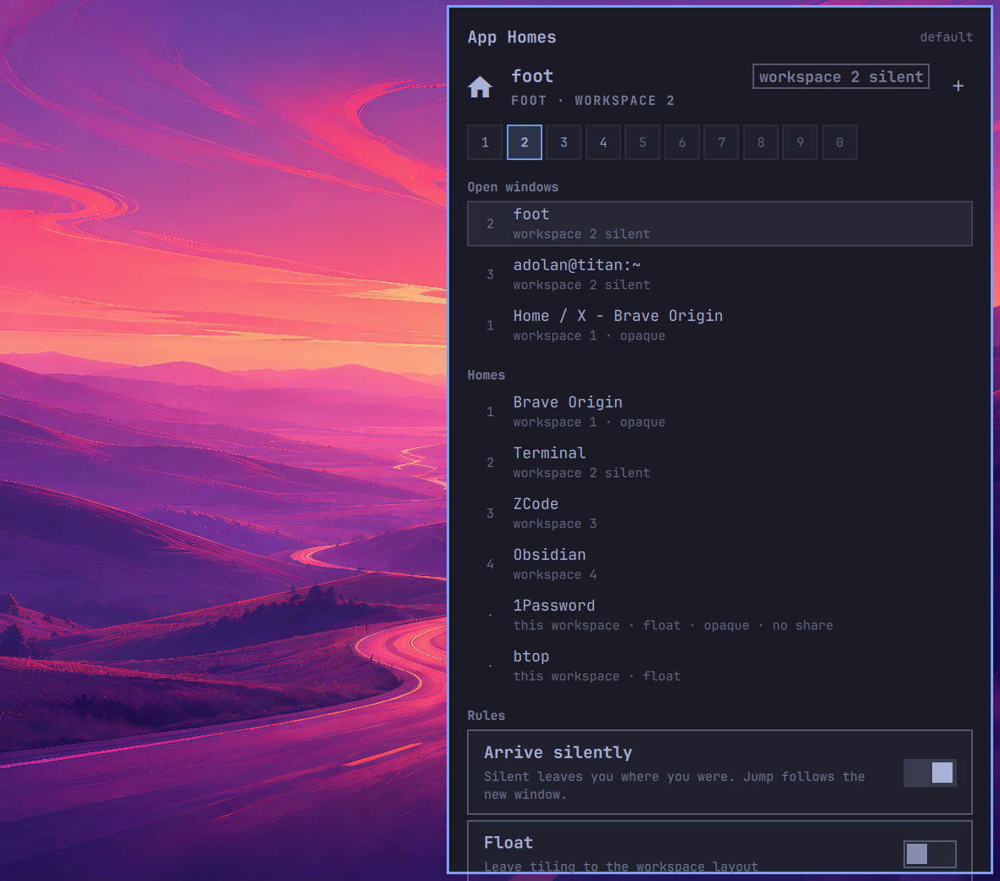

<div align="center">

# App Homes

**Apps should open where they live. Not wherever you happen to be.**

Pin Slack to 4, the browser to 2, btop floating, 1Password hidden from screen share.
Close them. Open them tomorrow. They still land in the same place.

<sub>AN <a href="https://omarchy.org">OMARCHY</a> PLUGIN &nbsp;·&nbsp; VERSION 0.0.1</sub>

<br /><br />

[What it does](#a-home-for-every-app) &nbsp;·&nbsp; [Install](#make-it-yours) &nbsp;·&nbsp; [Keys](#keys)

</div>



## Built for Omarchy

App Homes is a shell plugin for [Omarchy](https://omarchy.org). It uses the bar, the panel kit, and Hyprland's window rules. No extra daemon. No account. No network.

You pin an app once. Hyprland obeys on every later launch.

## A home for every app

Most tiling setups make you fix the same windows every morning. App Homes makes the rule stick.

| | |
| --- | --- |
| **Learn**<br />Focus a window and press L. The class is read from Hyprland. You never type a regex. | **Park**<br />Click 1 to 10. That workspace is now home. `0` is workspace 10. |
| **Arrive**<br />Silent opens the app without stealing you. Jump follows it. | **Behave**<br />Float, opaque, hide from screen share, keep awake. Off until you ask. |

A profile is the whole map. Duplicate it, switch it, and the next launch follows the new homes. Windows already open stay put.

This is not a session restore. It does not launch apps at login. It only tells Hyprland what to do when *you* open them.

## Pin it once

- The house in the bar shows the focused app's home as a small number. Dim house means nothing is pinned yet.
- Core Omarchy rules (JetBrains popups, browser opacity, 1Password) stay untouched. App Homes only adds your pins.
- JSON is the source of truth: `~/.config/omarchy/app-homes.json`. Edit it by hand. It reloads.
- Installing the plugin changes nothing until you pin something.

## Make it yours

```bash
omarchy plugin add https://github.com/Adolanium/omarchy-app-homes.git --enable
```

A house appears on the right of the bar. Click it, or bind it:

```lua
o.bind("SUPER + ALT + H", "App Homes", "omarchy-shell app-homes toggle")
```

Focus a window. Press L. Click a workspace.

### Remove it

```bash
omarchy plugin remove adolanium.app-homes
rm ~/.config/hypr/omarchy-app-homes.lua
```

The `dofile` line in `~/.config/hypr/hyprland.lua` is guarded. Leaving it does no harm. Windows go back to spawning wherever you are.

## Keys

Press `?` in the panel.

| Key | Does |
| --- | --- |
| `L` / Enter | Learn the focused window |
| `1`-`9` `0` | Pin to that workspace |
| `←` `→` | Move the home |
| `↑` `↓` | Select a window or a home |
| `A` | Silent or jump |
| `F` | Default, tile, or float |
| `O` | Opaque |
| `S` | Hide from screen share |
| `I` | Keep awake |
| `X` | Forget (twice) |
| `N` | Duplicate profile |
| `` ` `` | Open on this workspace |
| `Esc` | Close |

## Files

| Path | What |
| --- | --- |
| `~/.config/omarchy/app-homes.json` | Homes and profiles. Safe in dotfiles. |
| `~/.config/hypr/omarchy-app-homes.lua` | Generated. Do not edit. |
| `~/.config/hypr/hyprland.lua` | Gains one guarded load line on first run. |

To run without a bar widget, add `"adolanium.app-homes"` to `plugins[]` in `~/.config/omarchy/shell.json`.

## Limits

- Already-open windows do not move. Workspace, float, and tile run when the window is created. Pinning Slack sends the *next* Slack home, not this one.
- Matching is by class. Chromium PWAs often share a class. To pin Gmail apart from the browser, add a `title` in the JSON.
- Integer workspaces only. Named and special workspaces are left alone.

Needs Omarchy Quattro and Hyprland 0.55+. Tested on Hyprland 0.56.2, Omarchy 4.0.2.

## License

[MIT](LICENSE). Same as Omarchy.

<br />

<div align="center">
  <strong>App Homes</strong><br />
  <sub>Open it. It is already where it belongs.</sub>
</div>

<br />

> **Community project**
>
> App Homes is an independent plugin. It is not affiliated with, endorsed by, or sponsored by [Omarchy](https://omarchy.org) or [37signals](https://37signals.com). Omarchy is a name and mark belonging to its owners.
